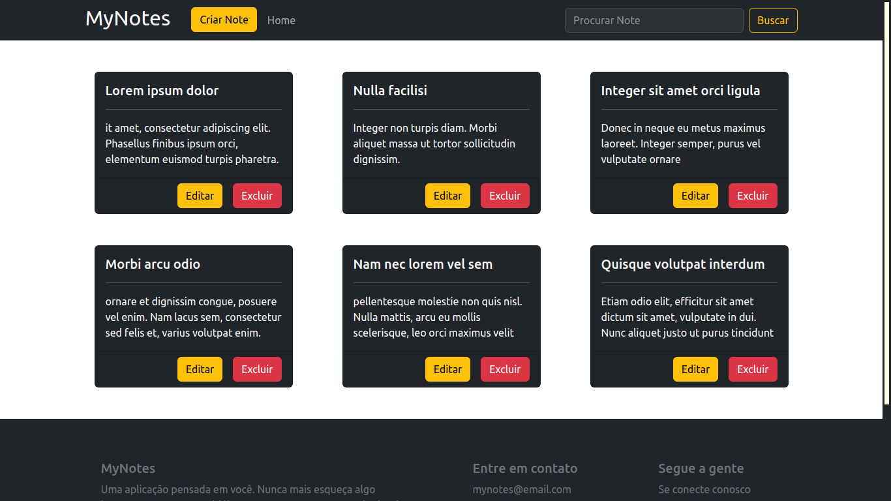
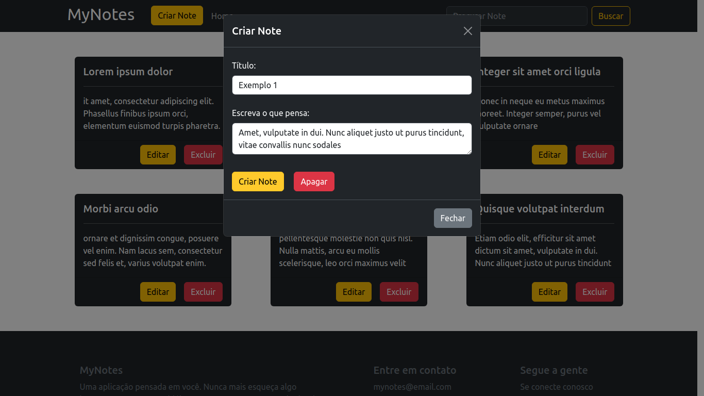
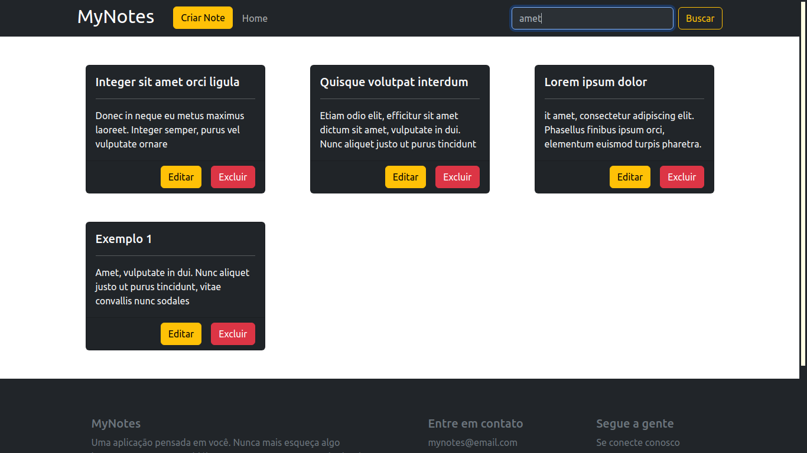
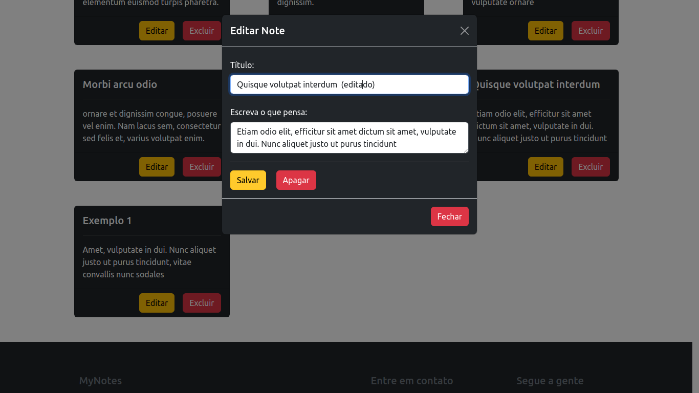

# MyNotes

MyNotes é uma aplicação web de notas mentais. Sistema feito para prática de criação de uma API Rest | disciplina de Bancos de Dados II, do Curso Superior de Tecnologia em Análise e Desenvolvimento de Sistemas, do IFPB/campus Cajazeiras

## Inicialização
Para inicializar o sistema:
1. Clonar o repositório
2. Criar na pasta raiz um arquivo .env, que apresenta os parâmetros de configuração do banco

Exemplo do arquivo .env (trocar os valores das chaves pelos dados do seu banco):
```
MDB_HOST = O host do seu cluster
MDB_USER = Seu usuário no Atlas
MDB_PASS = Sua senha
S_PORT = 3000
```

3. ```npm i```
4. ```npm start```

## Alterar parâmetros
Você pode alerar os dados da conexão do banco e da porta da API no arquivo .env

## Uso
Após o clone do repositório, digitar no terminal ```npm run  start```. A interface do sistema é básica e sugestiva, crie suas notas, pesquise notas específicas, atualize notas e exclua notas.

## Imagens







